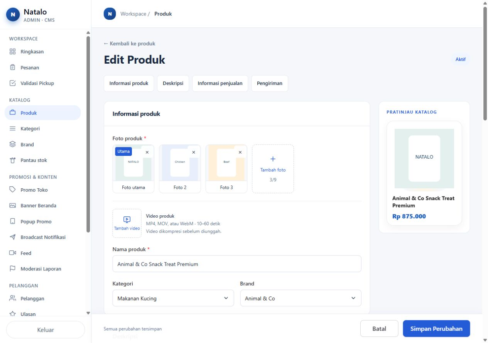
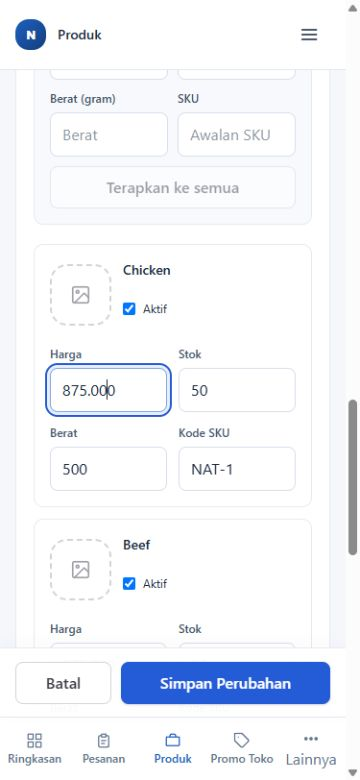

# Review implementasi admin premium — 4 Oktober 2026

## Status dan cakupan

Implementasi lokal mencakup fondasi tampilan admin bersama, daftar produk, tambah/edit produk, variasi, media, edit cepat, preview katalog, dan perbaikan label kategori Flutter. Perubahan belum di-deploy. Tidak ada migrasi database, perubahan dependency, atau penulisan data produksi dalam review ini.

Review ini dilakukan melalui pembacaan kode, pemeriksaan statis, dan viewer browser lokal yang membundel komponen implementasi dengan data contoh. Halaman operasional admin selain katalog mendapat fondasi bersama; setiap form dan alur backend halaman tersebut belum dinilai ulang secara menyeluruh. Audit mockup sebelumnya tetap merupakan penilaian rancangan, bukan bukti implementasi seluruh halaman.

## Hasil per pekerjaan

| Pekerjaan | Perubahan dan temuan yang diperbaiki | Bukti review | Batas bukti |
|---|---|---|---|
| Fondasi admin | Sidebar putih, kelompok navigasi, aksen biru, kartu, header, tombol dan spacing bersama. Savebar ponsel ditempatkan tepat di atas navigasi bawah. | Browser desktop, tablet 768 px, dan ponsel 375/390 px; pada sampel tidak ada overflow horizontal halaman. TypeScript/lint. | Viewer tidak menjalankan semua halaman server admin. |
| Motion dan transisi | Gerak halaman singkat, dialog masuk/keluar, disclosure grid, FLIP varian/foto, reduced motion. Perpindahan cepat memperhitungkan posisi animasi yang masih berjalan agar tidak melompat. | Review kode; perpindahan foto pointer dan keyboard; menu, dialog dan disclosure dibuka/ditutup dalam browser. | Tidak ada pengukuran FPS atau uji perangkat fisik. |
| Dialog, fokus dan notifikasi | Native dialog, Escape, pemulihan fokus, pending tidak dapat ditutup sembarang, fokus Batal pada konfirmasi. Ikon toast diperjelas; timer dihapus saat selesai/dismiss/unmount. | Escape mengembalikan fokus ke pemicu; konfirmasi arsip massal berfokus Batal dan dibatalkan. | Audit screen reader lengkap belum dilakukan. |
| Daftar produk | Nama produk dan Edit membuka form admin di tab baru. Harga/stok tetap dapat diedit cepat. Baris varian, pencarian, filter, arsip dan tindakan massal dipertahankan. Status Arsip diprioritaskan atas stok habis. | Klik nama membuka tab edit yang tepat dan tab daftar tetap ada; atribut Edit diperiksa di kode. | Daftar viewer adalah fixture; query/pagination halaman server diperiksa statis. |
| Edit cepat harga/stok | Input manual tanpa spinner, pemisah ribuan harga, validasi rentang, Simpan/Batal, error dan pending. Harga/stok semua varian atau satu varian tetap tersedia. | 875000 tampil 875.000; nilai negatif ditolak; bulk 400000 tampil 400.000 dan request fixture berisi angka 400000. Batal/Escape tidak mengirim perubahan. | Persistensi pada database asli belum dijalankan. |
| Form tambah/edit | Urutan Informasi produk → Deskripsi → Informasi penjualan → Pengiriman. Spesifikasi hanya Kategori dan Brand; care/dosis opsional lama tetap tersedia. Arsip memakai isActive=false. Savebar, error, pending dan guard perubahan belum disimpan. | Form asli dirender di viewer; Cancel saat dirty membuka konfirmasi dan Tinggalkan kembali ke daftar. | Guard meliputi tautan/Cancel dan beforeunload; navigasi Back internal SPA dan konflik dua tab belum mendapat mekanisme khusus. |
| Kategori, Brand dan AI | Pilihan tetap memakai kontrak lama; dialog dan tampilan diselaraskan. Penggantian deskripsi terisi meminta konfirmasi; proses AI/dosis memblokir save agar tidak terjadi race. Baris dosis parsial/invalid ditolak. | Review kode dan pemeriksaan statis; kategori/brand tampil dalam form browser. | Layanan AI dan CRUD master tidak dipanggil dalam viewer. |
| Variasi | Nama kelompok/pilihan dan matrix mengikuti pola Shopee, bulk harga/stok/SKU, foto per pilihan; tanpa label Kombinasi 1/2. Identitas pilihan stabil dan cache menjaga nilai saat rename. Grup baru maksimal 2 × 20 pilihan; data lama 3 grup/30 pilihan tetap dapat diedit. Batas 200 kombinasi. | Rename Chicken → Salmon tetap mempertahankan harga 900.000, stok 50, SKU NAT1. Validasi dan batas diperiksa di kode; matrix mobile dirender. | Transaksi kombinasi maksimum belum diukur pada database asli. |
| Foto produk | Drag mengikuti pointer dengan rAF, perpindahan FLIP, eased drop; keyboard tersedia tanpa instruksi teknis terlihat. Upload menjaga urutan pilihan; kontrol diblokir selama upload. | Foto pertama dipindahkan ke posisi ketiga; urutan menjadi Chicken, Beef, NATALO dan overlay drag tersisa 0. Keyboard ArrowRight menjaga fokus pada foto yang dipindahkan. | Unggah file asli belum dijalankan; URL foto duplikat identik belum dinilai khusus. |
| Video produk | Thumbnail 76 × 76, pilihan Ganti/Hapus, trim, kompresi sebelum upload/save. Queue WASM, timeout pipeline, exit code, reset/retry, cleanup worker dan blob resource pada kegagalan. | Review kode; thumbnail/kolom media dirender. TypeScript/lint. | Encode FFmpeg, unggah TUS, processing dan playback hasil asli belum dijalankan. |
| Preview katalog | Menggunakan ProductCard dan mapper katalog yang sama dengan storefront; rating memakai data aktual, CTA pelanggan dinonaktifkan dalam preview. Varian/harga mengikuti aturan save. | Komponen ProductCard aktual tampil dalam viewer; mapper/storefront ditinjau statis. | Voucher/shipping promotion yang ditambahkan terpisah saat storefront berjalan belum sepenuhnya direplikasi dalam form. Preview bukan simulasi checkout. |
| API dan identitas varian | Helper transaksi bersama mempertahankan ID varian yang masih ada untuk relasi order, promo dan langganan stok; varian yang dihapus soft retire. Menolak ID produk lain/duplikat, kombinasi invalid dan konflik SKU. Save tanpa perubahan varian tidak merebuild varian. Cache dan pencarian disegarkan lewat pola yang sudah tersedia. Rollback gagal sekarang menampilkan kemungkinan perubahan parsial. | Review helper/schema/routes; request fixture save tanpa perubahan tidak menyertakan payload varian. TypeScript/lint. | Prisma, timeout pada 200 kombinasi, order/promo/restock/search dan rollback produksi belum diuji integrasi. |
| Label kategori Flutter | Tulisan sheet dan chip memakai master name, filter tetap slug. Kandang & Carrier dan Obat & Suplemen tidak dibuat dari slug ketika nama API tersedia. Fallback dipakai saat data master belum tersedia. | Dart analyze bersih; pembacaan jalur nama dan nilai filter. | Build aplikasi/perangkat fisik belum dijalankan. |
| Viewer dan dokumentasi | Viewer localhost terisolasi, data contoh, pengganti Next API client, dan screenshot bukti. Aset bundle diabaikan Git. | Bundling berhasil; request katalog fixture dan konsol browser diperiksa. | Bukan server Next.js, staging, atau bukti end-to-end layanan. |

## Pemeriksaan yang telah selesai

- TypeScript seluruh proyek: `node node_modules/typescript/bin/tsc --noEmit --incremental false` — lulus.
- ESLint pada seluruh file implementasi yang berubah — lulus; dijalankan kembali untuk perubahan terakhir Toast dan FFmpeg.
- Flutter: `dart analyze lib/screens/products_screen.dart` — tidak ada issue.
- `git -c core.safecrlf=false diff --check -- app components lib flutter_app` — lulus.
- Bundling viewer lokal — berhasil.
- Konsol browser sampel review — tidak ada warning/error yang tertangkap pada pemeriksaan akhir.
- Simulasi GET varian gagal: error dan Coba lagi tersedia, Simpan dinonaktifkan; retry berhasil. Request ini hanya fixture lokal.

Tidak ada test suite formal yang ditambahkan/dijalankan. Script `npm run dev` dan `npm run build` tidak dipakai karena script repository menjalankan migrasi Prisma; tidak diperlukan untuk review terisolasi ini.

## Penilaian UI/UX lokal

**8,8/10 untuk tampilan dan interaksi katalog pada sampel lokal**, sebagai penilaian desain subjektif. Hierarki lebih jelas, alur variasi familiar, edit cepat dipertahankan, dan gerak memberi feedback singkat. Angka ini bukan skor kesiapan backend atau sertifikasi aksesibilitas.

Belum ada blocker tampilan yang ditemukan pada sampel akhir. Sebelum rilis diperlukan bukti integrasi backend untuk transaksi varian/relasi, upload dan kompresi video, sinkronisasi pencarian, serta pemeriksaan aplikasi Flutter pada perangkat. Mekanisme konflik edit dari dua tab dan guard Back SPA juga masih merupakan keterbatasan yang dicatat.

## Bukti visual

Cara menjalankan dan batas viewer: [README viewer](implementation-review/README.md).
